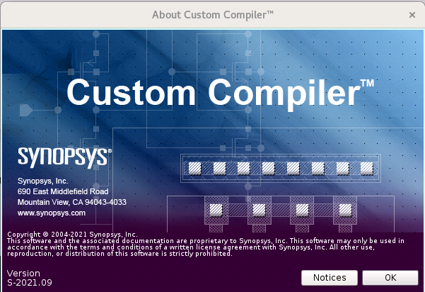
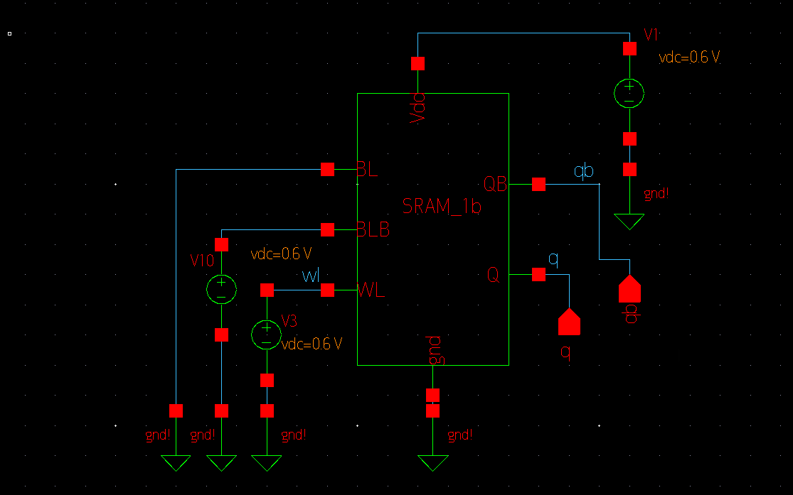
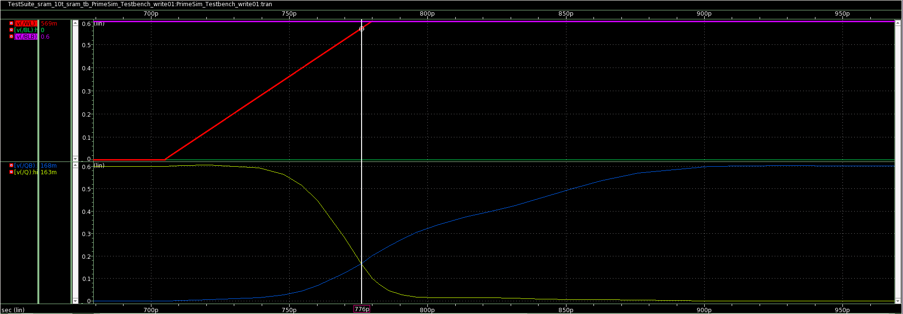
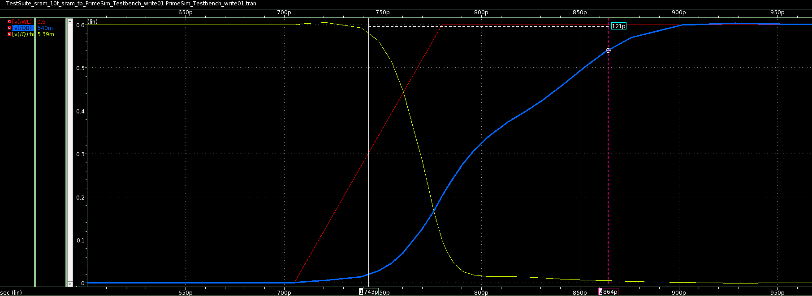

# Low-Power Schmitt Trigger Based 10T SRAM Cell
This repository contains the development and analysis of 10T SRAM using the Synopsys Custom Compiler tool. The 10T SRAM cell is designed on 28nm VLSI fabrication technology. This project was developed during the IIT Hyderabad Cloud-Based Analog IC Design Hackathon.
# Table of Contents
- [Introduction](#introduction)
  - [Problem Statement](#problem-statement)
- [Basics of SRAM](#basics-of-sram)
- [Tools Used](#tools-used)
- [SRAM Cell Design](#sram-cell-design)
- [SRAM Cell Analysis](#sram-cell-analysis)
  - [HSNM](#hsnm)
  - [RSNM](#rsnm)
  - [WSNM](#wsnm)
  - [BLM](#blm)
  - [WLM](#wlm)
  - [Write Access Time](#write-access-time)
  - [Area Estimates](#area-estimates)
- [Conclusion](#conclusion)
- [Author](#author)
- [Acknowledgements](#acknowledgements)
- [References](#references)

# Introduction

SRAMs are the type of random access memories. They store information in the form of static latch (cross-coupled inverters). They don't require periodic refresh and have short access delays and low power consumption. Due to these properties, they are a better contender for cache memories inside the processors and microcontrollers. They are usually present in various sizes ranging from several KBs to a few MBs'.

## Problem Statement

Development and analysis of a 10T SRAM cell on 28nm fabrication technology using Synopsys Custom Compiler.
1. Plot the various signal to noise margins.
2. Determine the access time.
3. Calculate the area estimates.

# Basics of SRAM

Let us first understand how a [6T SRAM](images/6t.png) cell works.  It consists of two cross-coupled inverters (MNL, MPL and MNR, MPR) and two access transistors at its complementary nodes Q and QB. The two bit lines (BL and BLB) are connected through access transistors. The access transistors are controlled by wordline (WL). Wordline is set 1 or 0 according to the operation needed. 1 for write operation and 0 for read as can be better understood by the following table.

| Control Signal  | Operation | Operation | Operation | Operation |
| --- | --- | --- | --- | --- |
|     | Write '0' | Write '1' | Read | Hold |
| BL  | 0 | 1 | Pre | 1|
| BLB | 1 | 0 | Pre | 1|
| WL  | 1 | 1 | 1   | 0|


The [10T SRAM](images/10t.png) circuit designed in this project is similar in operation to the 6T SRAM cell except for critical parameters like static noise margins (SNM) are improved. At the same time, a compromise is made with the area requirements; a however significant improvement on SNM is observed. To improve the inverter characteristics, the Schmitt trigger configuration is used. A Schmitt trigger increases or decreases the switching threshold of an inverter depending on the direction of the input transition. This adaptation is achieved with the help of a feedback mechanism [1](#references).


# Tools Used
Synopsys custom compiler was provided over the remote desktop connection to the participants of this hackathon. Also, a 32nm PDK was provided that included the model files of the respective design elements like NMOS, PMOS, BJT etc. The test benches are simulated using Primewave, and the waveforms are shown on Wave view applications.



# SRAM Cell Design

The [schematic](images/10ts.png) of the primary cell is designed using 10 transistors (8 NMOS and 2 PMOS). Ports are created for inputs, outputs and power supply. Finally, a symbol is created from the schematic. This symbol is then further used to first analyze the cell metrics; then, it can be used to scale the design to realize n-bit SRAM.


The netlist of the 10T SRAM cell is:
```
.subckt sram BL BLB Q QB Vdd WL gnd
*.PININFO BL:B BLB:B Q:O QB:O Vdd:I WL:I gnd:I
MM7 BLB WL QB gnd n105 w=0.1u l=0.03u nf=1 m=1
MM6 Vdd QB net5 gnd n105 w=0.1u l=0.03u nf=1 m=1
MM5 BL WL Q gnd n105 w=0.1u l=0.03u nf=1 m=1
MM4 Vdd Q net15 gnd n105 w=0.1u l=0.03u nf=1 m=1
MM3 Q QB net15 gnd n105 w=0.1u l=0.03u nf=1 m=1
MM2 net15 QB gnd gnd n105 w=0.1u l=0.03u nf=1 m=1
MM1 net5 Q gnd gnd n105 w=0.1u l=0.03u nf=1 m=1
MM0 QB Q net5 gnd n105 w=0.1u l=0.03u nf=1 m=1
MM9 QB Q Vdd Vdd p105 w=0.1u l=0.03u nf=1 m=1
MM8 Q QB Vdd Vdd p105 w=0.1u l=0.03u nf=1 m=1
.ends sram
```

The above circuit is simulated and the [waveform](images/wave_write.png) depicts the successful write 0 and write 1 operation. The [circuit setup](images/ckt.png) is done by connecting the corresponding inputs, outputs, and power supply as mentioned in the following table.

| Parameter | Value |
| --- | --- |
| Voltage Supply (Vdc)  | 0.6v  |
| Rise Time | 75ps  |
| Bit-line Period (BL and BLB)  | 1.2us |
| Word-line Period (WL) | 700ps |


# SRAM Cell Analysis
In this project the following analysis are conducted on the 10T SRAM cell:

## HSNM

The hold static noise margin is derived by latching the WL to logic 0 and BL & BLB to logic 1 as shown in the following [circuit](images/hsnmckt.png). Then the dc sweep analysis is done to the voltage at the pin Q, and the corresponding QB voltage is recorded. Then a QB(v) vs Q(v) graph is plotted by importing the simulation data in MS excel. The corresponding graph results in the hold SNM butterfly curve. The largest square that can fit inside the openings of the curve signifies the maximum amount of noise the 10T SRAM can withstand while in hold condition. We have estimated HSNM to be **0.26v** for the designed circuit. The corresponding waveforms of Q and QB in wave view can be seen [here](images/hsnmwv.png).


## RSNM

The read static noise margin is derived by latching the WL to logic 1 and BL & BLB to logic 1, as shown in [circuit](images/rsnmckt.png). Then the dc sweep analysis is done to the voltage at the pin Q, and the corresponding QB voltage is recorded. Then a QB(v) vs Q(v) graph is plotted by importing the simulation data in MS excel. The corresponding graph results in the read SNM butterfly curve. The largest square that can fit inside the openings of the curve signifies the maximum amount of noise the 10T SRAM can withstand while in a read state. We have estimated RSNM to be **0.08v** for the designed circuit. The corresponding waveforms of Q and QB in wave view can be seen [here](images/rsnmwv.png).


## WSNM

The write static noise margin is derived by latching the WL & BLB to logic 1 and BL to logic 0, as shown in [circuit](images/wnmckt.png). Then the dc sweep analysis is done to the voltage at the pin QB, and the corresponding QB voltage is recorded. Then a QB(v) vs Q(v) graph is plotted by importing the simulation data in MS excel. Then the plotted WSNM is plotted on the same graph of the RSNM, and the largest square that can fit inside the openings of the curve signifies the measure of the ability of the cell to pull down a logic 1 storing node to a voltage less than switching threshold voltage. We have estimated WSNM to be **0.26v** for the designed circuit. The corresponding waveforms of Q  in wave view can be seen [here](images/wsnm_cc.png).


## BLM

The WSNM from the butterfly curve method has the limitation of its inability to measure with inline testers directly. It has been reported that WSNM does not correctly reflect the write-ability of cells with a large write margin. Therefore,  bit line margin (BLM) and word-line margin (WLM) are helpful and easy methods to measure the write ability of SRAM cells. The circuit setup for the BLM is shown [here](images/blmckt.png). The voltage source connected to the BL pin is swept from 0.7v to 0v, and the corresponding Q and QB voltages are plotted on the graph. The point where the Q and QB intersect, then the y-axis voltage where it intersects with the BL is recorded, and it is the BLM. In this work, it is found to be **0.37v**.


## WLM

Like the BLM, the word line margin (WLM) is calculated by latching the BL pin to logic 0 and BLB to logic 1 and then sweeping the WL from 0 to 0.6v. The voltage point where the Q and QB waveforms intersect when subtracted from the Vdd gives the WLM. In this design, it is found to be 0.05v. The low values of WLM suggest a difficult write operation.




## Write Access Time

Write access time or write delay (T<sub>WA</sub>) is the time required for node Q or QB (high going node) to rise to 90% of its final value after WL is activated (i.e., 50% of the final value) during write operation. In this design, it is observed to be 121ps.


## Area Estimates

Since we have used UCB's BSIM4 (Level 54) supporting 28nm technology PDK, the device's width used in this project is 0.1um, and the channel length (L) is 0.03um. Since these are insufficient to precisely calculate the area of the device but we can make a rough estimate. Roughly the area occupied by 10 transistors (considering the poly-silicon interconnects) is around 0.12pm<sup>2</sup>.

# Conclusion

A schmitt trigger-based 10T SRAM is successfully designed using synopsys custom compiler software. The read, write and hold operations of the SRAM are successfully verified. Also, an analysis of seven critical design parameters is carried out. It is found that the SRAM performs well on the analysed parameters. However, weak write operation fault persists and can be mitigated through high input voltages.

# Author
**Mohammad Mudakir Fazili**, *M.Tech Micro-electronics*, NIT Srinagar                                                                                           
*mudakirfazili@gmail.com*

# Acknowledgements
1. [IIT Hyderabad](https://iith.ac.in/)
2. [VLSI System Design Corporation](https://www.vlsisystemdesign.com/)
3. [Synopsys](https://www.synopsys.com/)

A special vote of thanks to **Kunal Ghosh** (founder VSD), **Chinmay panda** (IIT Hyderabad), **Sameer Durgoji** (NIT Karnataka)

# References
1.  J. P. Kulkarni, K. Kim and K. Roy, "A 160 mV Robust Schmitt Trigger Based Subthreshold SRAM," in IEEE Journal of Solid-State Circuits, vol. 42, no. 10, pp. 2303-2313, Oct. 2007, doi: 10.1109/JSSC.2007.897148.
2.  Ahmad, Sayeed, Naushad Alam, and Mohd Hasan. "Pseudo differential multi-cell upset immune robust SRAM cell for ultra-low power applications." AEU-International Journal of Electronics and Communications 83 (2018): 366-375, doi: 10.1016/j.aeue.2017.09.022.
