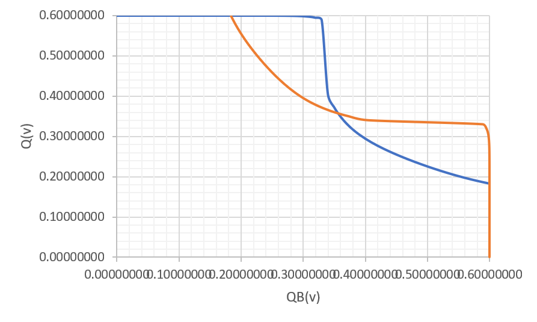

# Low-Power Schmitt Trigger Based 10T SRAM Cell
This repository contains the development and analysis of 10T SRAM using Synopsys Custom Compiler tool. The 10T SRAM cell is designed on 28nm VLSI fabrication technology. This project was developed during the IIT Hyderabad Cloud Based Analog IC Design Hackathon.

# Table of Contents
- [Introduction](#introduction)
  - [Problem Statement](#problem-statement)
- [Basics of SRAM](#basics-of-sram)
- [Tools Used](#tools-used)
- [SRAM Cell Design](#sram-cell-design)
- [SRAM Cell Analysis](#sram-cell-analysis)
  - [HSNM](#hsnm)
  - [RSNM](#rsnm)
  - [WSNM](#wsnm)
  - [Access Time](#access-time)
  - [Area Estimates](#area-estimates)
- [Comparative Analysis](#comparative-analysis)
- [References](#references)

# Introduction

SRAM's are the type of random access memories. They store information in the form of static latch (cross-coupled inverters). They dont require periodic refresh and have short access delays and low power consumption. Due to these properties they are a better contedor for cache memories inside the processors and microcontrollers. They are usually present in various system in sizes ranging from several KBs to a few MBs'.

## Problem Statement

Development and analysis of a 10T SRAM cell on 28nm fabrication technology using Synopsys Custom Compiler.
1. Plot the various signal to noise margins.
2. Determine the access time.
3. Calculate the area estimates.

# Basics of SRAM

A schmitt trigger (ST) based 10T SRAM is designed in this work. Let us first understand how a [6T SRAM](images/6t.png) cell works. It consists of two cross-coupled inverters (MNL, MPL and MNR, MPR) and two access transistors at its complementary nodes Q and QB. The two bit lines (BL and BLB) are connected through access transistors. The access transistors are controlled by wordline (WL). Wordline is set 1 or 0 according to the operation needed. 1 for write operation and 0 for read as can be better understood by the following table.

| Control Signal  | Operation | Operation | Operation | Operation |
| --- | --- | --- | --- | --- |
|     | Write '0' | Write '1' | Read | Hold |
| BL  | 0 | 1 | Pre | 1|
| BLB | 1 | 0 | Pre | 1|
| WL  | 1 | 1 | 1   | 0|

The [10T SRAM](images/10t.png) circuit designed in this project is similar in operation to the 6T SRAM cell except crital parameters like static noise margins (SNM) are improved. While an compromise is made with the area requirements however significant improvement on SNM is observed.

# Tools Used
Synopsys custom compiler was provided over remote desktop connection to the participants of this hackathon. Also, a 32nm PDK was provied that included the model files of the respective design elements like NMOS, PMOS, BJT etc. The testbenches are simulated using Primesim and the waveforms are shown on Waveview applications.

# SRAM Cell Design

The [schematic](images/10ts.png) of the basic cell is designed using 10 transistors (8 NMOS and 2 PMOS). Ports are created for inputs, outputs and power supply. Finally a symbol is created from the schematic.

# SRAM Cell Analysis
x

## HSNM

## RSNM

## WSNM

## Access Time

# Area Estimates

# Comparative Analysis

# References
